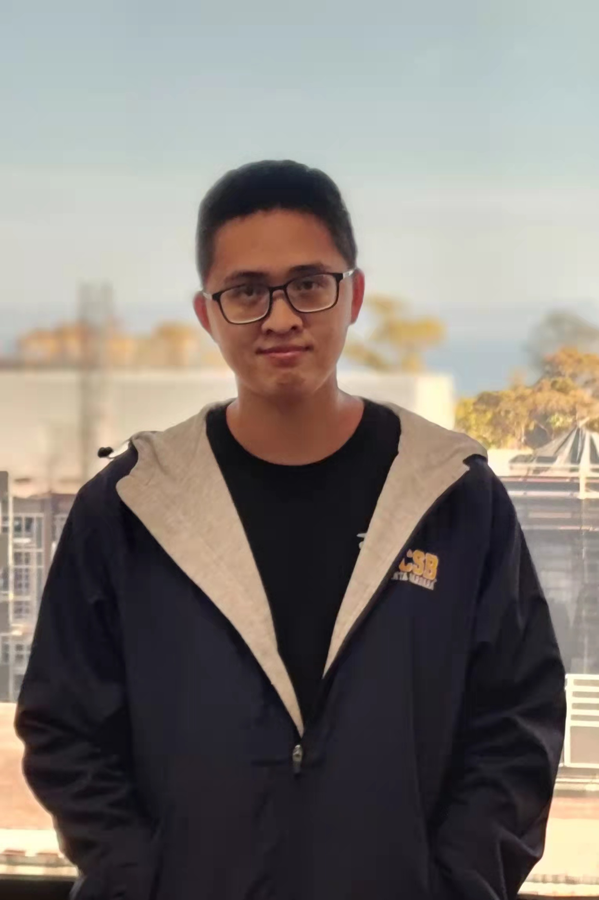
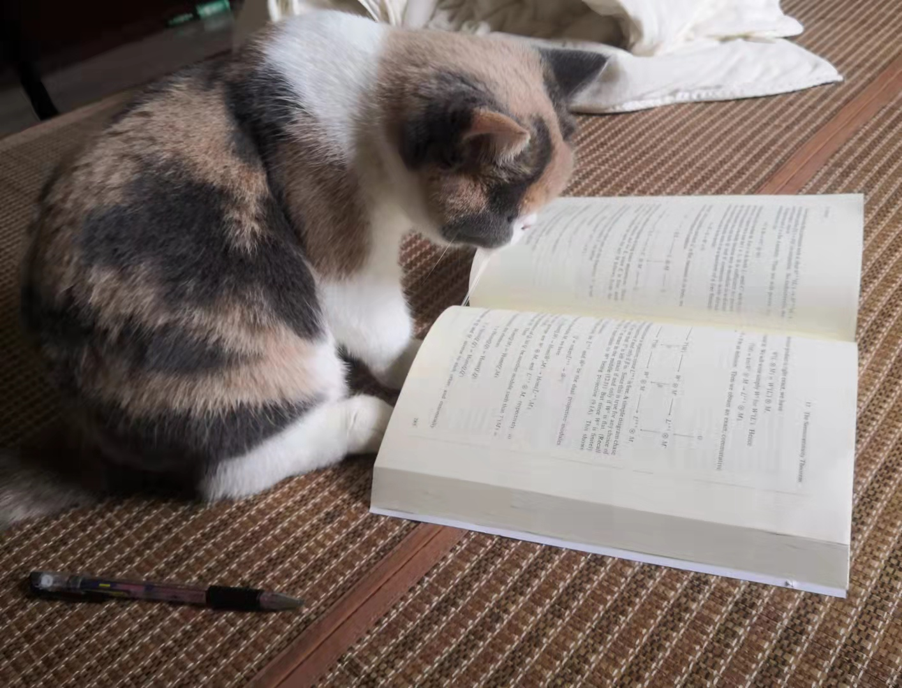
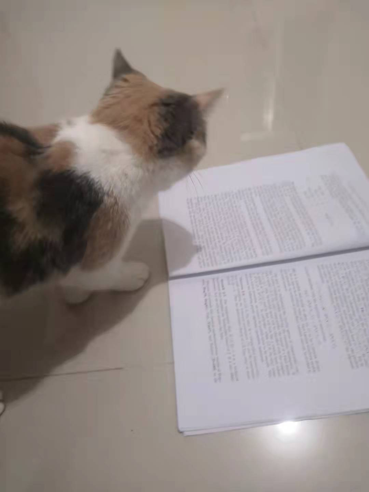
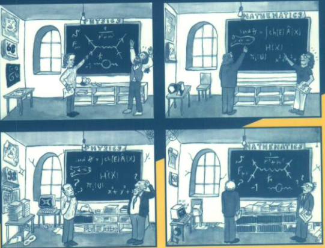

[About me](#R1)&emsp;&emsp;&emsp;&emsp;&emsp;&emsp;&emsp; [Research](#R2)&emsp;&emsp;&emsp;&emsp;&emsp;&emsp;&emsp;
[Notes](#R21)&emsp;&emsp;&emsp;&emsp;&emsp;&emsp;&emsp;
[Teaching](#R3)&emsp;&emsp;&emsp;&emsp; &emsp;&emsp;&emsp;
[Some pictures](#R4)&emsp;

## About me.

I started my undergraduate training in 2013 at School of Mathematical Science, Nankai University, Tianjin, China.

I am currently a Ph. D. candidate at University of California, Santa Barbara, since 2017. My advisor is [Xianzhe Dai](http://web.math.ucsb.edu/~dai/).

Starting in the fall of 2022, I'll be a postdoctoral fellow at Beijing International Center for Mathematical Research (BICMR), Peking University, Beijing, China.

<table><tr><td></td><td>
If I were a Springer-Verlag Graduate Text in Mathematics, I would be J.-P. Serre's <b><i>Linear Representations of Finite Groups</i></b>.

 My creator is a Professor at the College de France.  He has previously published a number of books, including Groupes Algebriques et Corps de Classes, Corps Locaux, and Cours d'Arithmetique (A Course in Arithmetic, published by Springer-Verlag as Vol. 7 in the Graduate Texts in Mathematics). 

Which Springer GTM would <i>you</i> be?  <a href="http://math.jhu.edu/~savitt/GTM.html">The Springer GTM Test</a>
</td></tr></table>

### Email Address 
[j_yan@math.ucsb.edu](j_yan@math.ucsb.edu) 
### Curriculum Vitae
Click [here.](Junrong_Yan_s_CV (2).pdf)
### Research Statement
Click [here.](Research_Statement (2).pdf)

Besides mathematics, I enjoy playing the card game Yu-Gi-Oh , cycling and swimming.

## Research

My main interests are geometric analysis, PDEs and mathematical physics. More concretely, I attempt to understand QFT and string theory from index theoretic point of view. See my [Research Statement](Research_Statement (2).pdf) for more details.

### Publications and Preprints
#### Accepted or published
1. Xianzhe Dai and Junrong Yan. Witten Deformation for Noncompact Manifolds with Bounded Geometry, [Journal of the Institute of Mathematics of Jussieu](https://doi.org/10.1017/S1474748021000232)，1-38 (2020)

#### Preprints
2. Xianzhe Dai and Junrong Yan. Witten Deformation on Non-compact Manifold: Heat Kernel Expansion and Local Index Theorem, [ArXiv:2011.05468](https://arxiv.org/abs/2011.05468), 31 pages
3. Xinxing Tang and Junrong Yan. Calabi-Yau/Landau-Ginzburg Correspondence for Weil-Peterson Metrics and tt∗ Structures, [ArXiv:2205.05791](https://arxiv.org/abs/2205.05791), 34 pages

#### In preparation
3. Xianzhe Dai and Junrong Yan. Analytic Torsion for Witten Deformation on Non-compact Manifold
4. Xianzhe Dai and Junrong Yan. The Non-semiclassical Weyl's Law for Schrodinger Operators
on Non-compact Manifolds

#### My Thesis
Click [here](dissertation (3).pdf)

### Here are the projects that I am currently working on

#### Witten Laplacian on noncompact manifolds
This is a joint project with [Xianzhe Dai](http://web.math.ucsb.edu/~dai/).
#### Weyl's law on noncompact manifolds
This is a joint project with [Xianzhe Dai](http://web.math.ucsb.edu/~dai/).
#### BCOV torsion for LG models
This is in various parts joint with with [Xianzhe Dai](http://web.math.ucsb.edu/~dai/) and [Xinxing Tang](http://ymsc.tsinghua.edu.cn/en/content/show/146-253.html).
#### Renormalization theory and its application to BCOV theory
This is a joint project with [Si Li](https://sili-math.github.io/).

 

 
## Notes

1. Notes on [Connes Fiberation](Notes3.pdf)
2. Prof. Dai's lecture on [Determinants, Analytic Torsion, and Mirror Symmetry](Notes4.pdf)
3. My Guest lecture on [Index Theorem, Positive Scalar Curvature and Enlargibility](Notes1.pdf) in Prof. Dai's [Math 241C, 2022 Spring](Notes2.pdf).

 

 
## Teaching

### Instructor
1. _Math 3B: Calculus with Applications_, Summer 2021

### Teaching Assistant
1. _Math 8: Transitions to Higher Mathematics_, Spring 2018
2. _Math 8: Transitions to Higher Mathematics_, Fall 2018
3. _Math 6B: Vector Calculus_, Winter 2019
4. _Math 34B: Calculus for Social and Life Sciences_, Spring 2019
5. _Math 6A: Vector Calculus_, Fall 2019
6. _Math 6A: Vector Calculus_, Winter 2020
7. _Math 6A: Vector Calculus_, Summer 2020
8. _Math 8: Transitions to Higher Mathematics_,  Fall 2020
9. _Math 6A: Vector Calculus_, Winter 2021
10. _Math 6A: Vector Calculus_, Spring 2021

### Reader
1. _Math 117: Methods of Analysis_, Fall 2017
2. _Math 108B: Introduction to Linear Algebra_, Winter 2018
3. _Math 117: Methods of Analysis_, Fall 2019

 

 

 
## Some pictures

### My Sweetheart

### This is Sardine, say hi

### Sardine is doing diagram chasing
 

### Sardine is reviewing my paper 
  

### Sardine is charging

### A picture on the front cover of _Quantum Fields and Strings_

Hits  
